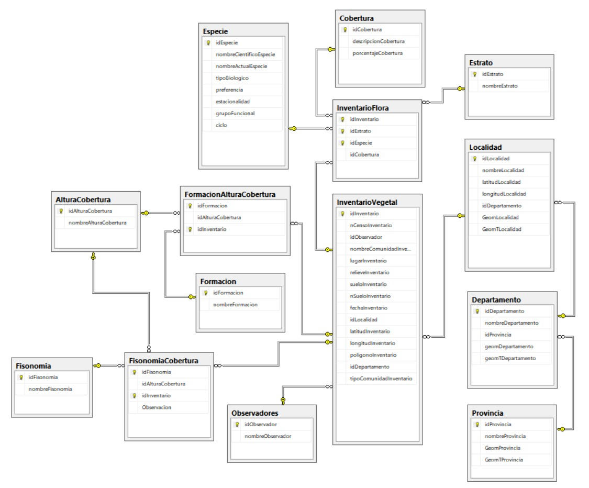

# InventarioRRNN

<!-- badges: start -->

<!-- badges: end -->

El paquete de datos de R inventarioRRNN es parte de una serie de actividades del INTA Anguil y la Universidad Nacional de La Pampa 
para abrir los datos primarios del inventario de recursos naturales de La Pampa. 

Estos datos fueron digitalizados y almacenados en una base de datos relacional geográfica y se disponibiliza por medio de un sitio web 
que permite su consulta y mapeo [1]. 

inventarioRRNN se presenta como otra forma de distribuir los datos primarios junto con su documentación para usuarios de R.  
De esta manera es más sencillo integrar estos datos de base en otros análisis y modelos que se realizan utilizando el lenguaje R.

[1] [Sistema de Información y base de datos para el inventario de recursos naturales de La Pampa](https://45jaiio.sadio.org.ar/sites/default/files/CAI-20.pdf). Juan Caldera, Raúl Peinetti, 
Daniel Estelrich, Claudia Chirino, Yanina Bellini Saibene, Marcos Lorda. CAI 2016, Octavo Congreso de AgroInformática. 2016.

## Base de datos

## Funciones

### Reporte Censos

Esta funcion implementa la consulta que se presenta en esta visualizacion: https://public.tableau.com/app/profile/juan.caldera/viz/CensosdevegetacionUNLPam/Hoja5
